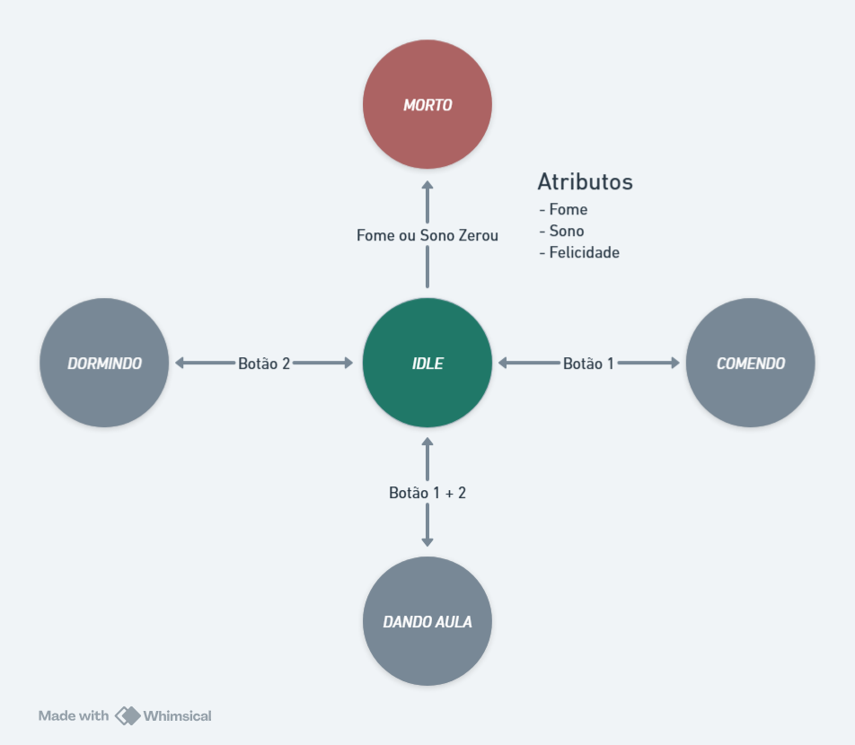

# ZANAGOTCHI  

Implementação em Verilog de um tamagotchi para ser utilizado em FPGA's.  

O conceito do Tamagotchi é ser uma espécie de pet que o dono tem que cuidar.

 

Para uma primeira implementação, geramos essa máquina de estados:  
**IDLE** - Zanagotchi parado executando animações mostrando ele se mexendo, olhando em volta, etc. 

- Ao pressionar o botão **1**: Zanagotchi vai para o estado *COMENDO*;
- Ao pressionar o botão **2**: Zanagotchi vai para o estado *DORMINDO*;
- Ao pressionar o botão **1 e 2** juntos: Zanagotchi vai para o estado *DANDO_AULA*;
- Ao segurar o botão **1 e 2** juntos: Reseta o game, volta para a tela de *INTRO* com os atributos iniciais;  

**INTRO** - Tela inicial do jogo, ao apertar algum botão vai para **IDLE**  
**COMENDO** - Zanagotchi executa animação de comer e seu atributo **Fome** aumenta em uma taxa constante.  
**DORMINDO** - Zanagotchi executa animação de dormir e seu atributo **Sono** aumenta em uma taxa constante.  
**DANDO_AULA** - Zanagotchi executa animação de dar aula e seu atributo **Felicidade** aumenta em uma taxa constante.  
**MORTO** - Se algum dos atributos chegar a um valor menor ou igual a 10, um túmulo é mostrado na tela.  

## Funcionamento  

Resumidamente, todas as ações executáveis seguem o mesmo padrão de funcionamento:    

IDLE --> Botão X --> Tela de animação da ação --> Qualquer botão --> IDLE  

Durante todas as telas (Menos a de morte e de intro), as barras de Fome, Sono e Felicidade aparecerão no topo da tela. Além disso, enquanto uma ação estiver sendo executada, o atributo correspondente será preenchido aos poucos e será possível ver isso acontecendo.    

## Módulos

### Zanagotchi

Módulo do topo que junta todos os módulos necessários para funcionamento do Zanagotchi.

### Controlador Estados  

Módulo que controla a troca de estados baseado na combinação de botões pressionados.  

### Controlador Imagens

Módulo que retorna bit a bit de uma imagem de acordo com o estado, e também as barrinhas que indicam os atributos.  

### Controlador Display

Módulo que efetivamente pinta os pixels da tela do display de acordo com os dados recebidos.  

### Controlador Botão

Módulo que recebe a entrada dos botões e trata elas para entrarem no controlador de estados corretamente.

### Controlador Atributos

Módulo que controla operações sobre os atributos definidos baseado no estado atual.  

# Demonstração

