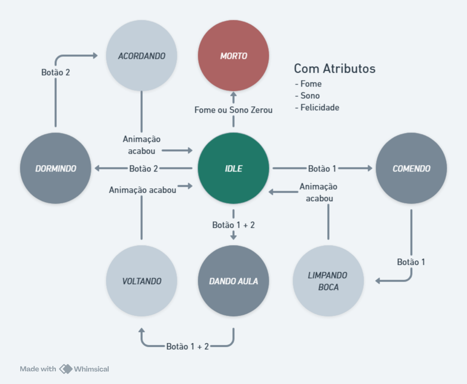

# ____gotchi  

Implementação em Verilog de um tamagotchi para ser utilizado em FPGA's.  

O conceito do Tamagotchi é ser uma espécie de pet que o dono tem que cuidar.

  

Para uma primeira implementação, geramos essa máquina de estados:  
**IDLE** - Tamagotchi parado executando animações mostrando ele se mexendo, olhando em volta, etc.  
**DORMINDO** - Ao pressionar o botão 2, o pet executará a animação de dormir. Ao apertar o botão 2, ele voltará ao estado *IDLE*, mas não antes do estado *ACORDANDO*.  
**ACORDANDO** - Ocorre quando o botão 2 é apertado durante o estado *DORMINDO*, executará a animação de acordar e voltará para o estado *IDLE*.  
**COMENDO** - Ao pressionar o botão 1, o pet come algo.  
**LIMPANDO A BOCA** - Ocorre quando o botão 1 é apertado durante o estado *COMENDO*, executará a animação de limpar a boca e voltará para o estado *IDLE*.  
**DANDO AULA** - Ao pressionar o botão 1 ao mesmo tempo que o botão 2, o pet executará a animação de dar aula, ao pressionar os dois botões novamente ele irá para o estado *VOLTANDO*.  
**VOLTANDO** - Ocorre quando os dois botões são pressionados durante o estado *DANDO AULA*, executará a animação de voltar para o *IDLE*.  
**MORTO** - Ocorre quando alguma das barras zera, levando o pet à morte.  
